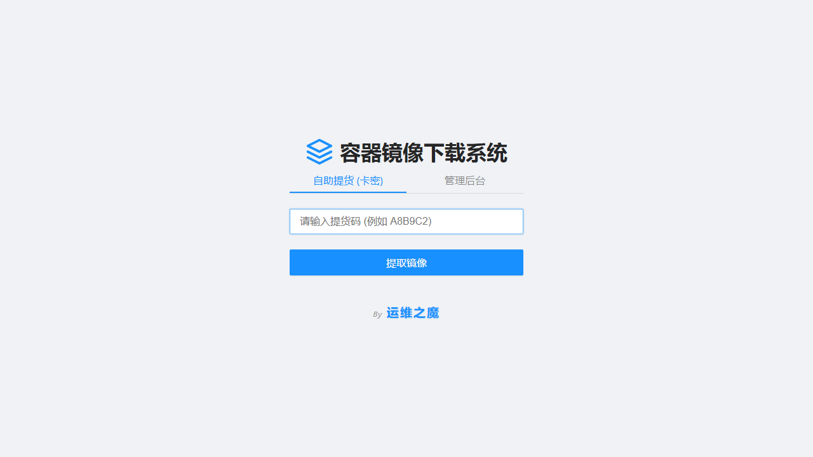
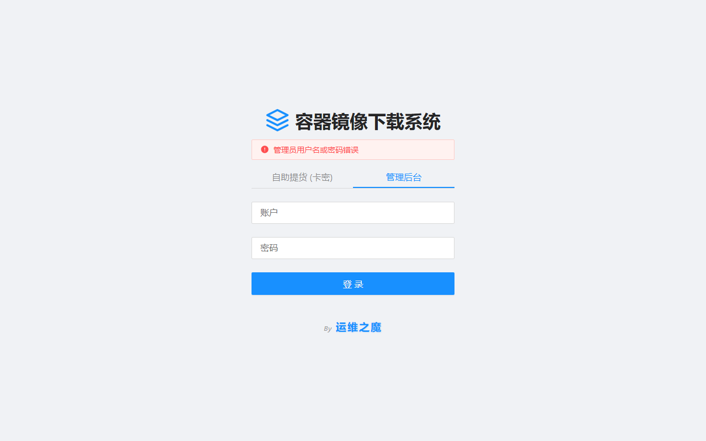

<div align="center">
  <h1>🐳 容器镜像站点下载系统</h1>
  <p>
    <strong>一个极简、零依赖、基于纯 Go 与 SQLite 构建的私有容器镜像下载与用户授权管理平台</strong>
  </p>
  <p>
    
    
    
  </p>
</div>

## 📖 项目简介
本项目旨在为团队或个人提供一个轻量级的**容器镜像下载与分发控制站点**。通过内置的 Web 用户管理系统，管理员可以安全地限制镜像的访问权限，确保私有云原生资产的安全。

整个项目由 Go 语言开发，采用纯 Go 版本的 SQLite 驱动，完全摒弃了对 CGO 编译环境的依赖，实现真正的**“极速编译，单文件无感部署”**。

> **🖼️ 系统界面预览**
> 
> *(提示：你可以在同目录下放一张名为 `screenshot.png` 的截图，它会自动在这里展示)*
> 
> **前端登录页面：**
> 
> 
> 
> **后台管理控制台：**
> 
> 

## ✨ 核心特性
- **🔒 安全可控的 Web 授权**：内置网页端登录界面、用户验证与基于 Token 的会话管理机制。
- **📦 极致轻量 (零依赖)**：使用 `modernc.org/sqlite`，无需安装 GCC 即可跨平台交叉编译。
- **🚀 单文件开箱即用**：所有的前端 UI (HTML/CSS/JS) 均通过 Go Template 内嵌至二进制程序中，无需额外配置 Nginx 或放置静态资源目录。
- **🛠 极简的运维体验**：单一的运行产物 + 单一的 `data.db` 数据文件，完美契合容器化与轻量级部署需求。

## 🛠 技术栈
- **后端框架**：[Golang](https://go.dev/) (原生 `net/http` 路由)
- **持久化存储**：[modernc.org/sqlite](https://gitlab.com/cznic/sqlite)
- **前端渲染**：`html/template` 标准库

## 🚀 快速开始

### 1. 获取源码
```bash
git clone https://github.com/caijintian/container-image-downloader.git
cd container-image-downloader
```

### 2. 解决依赖
```bash
go mod tidy
```

### 3. 本地开发与测试
```bash
go run main.go
# 启动后，访问 http://localhost:8989 即可进入系统
```

### 4. 生产环境构建
```bash
# 编译生成极致压缩的跨平台二进制包
CGO_ENABLED=0 go build -ldflags="-s -w" -o image-downloader main.go
```
*编译完成后，直接把 `image-downloader` 丢到任何服务器上运行即可，完全不需要其他依赖环境！*

## 📁 核心目录结构
```text
container-image-downloader/
├── main.go        # 核心业务逻辑与内嵌的前端 UI 模板
├── go.mod         # 模块依赖定义
└── README.md      # 项目说明文档
```

## 🤝 参与贡献
发现 Bug？有很酷的新功能建议？欢迎随时提交 **Issue** 或发起 **Pull Request**！

## 📄 开源协议
本项目采用 MIT 协议开源，你可以自由地在商业或个人项目中使用。
